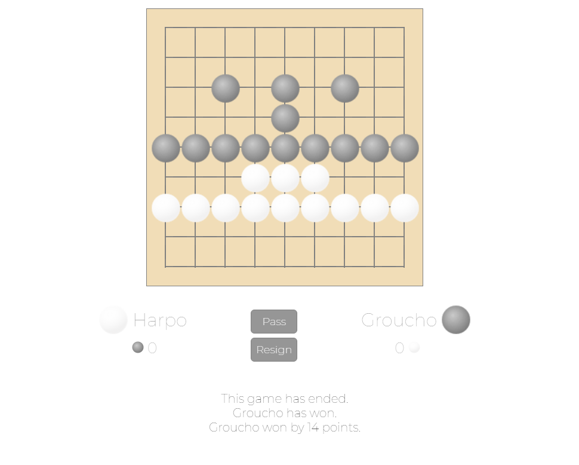

# Online Go

### _Created By_ **Joseph Friesen**, **Chris Gosser**, **Ben Kiggen**, and **Michael Meow**

## Description

This application is an implementation of the [ancient game of Go](https://en.wikipedia.org/wiki/Go_(game)), that can be played locally by two players on a single device or by two players remotely. Playing remotely, both players navigate to the start screen in their browser, and one player creates the game, filling in both players' names and specifiying a board size (9x9, 13x13, or 19x19). A new game is created, with players randomly assigned to play either the black stones or the white stones, and on both devices the browser will automatically navigate to the game screen. As a player makes a turn, the game information is updated in realtime in the Firebase database, and the view (game board and stones, current player, any stone captures either player has made) is updated accordingly on both devices. Finally, when a game end condition is met (both players pass consecutively, or one player resigns), a winner is determined, with the winner's name (and margin of victory, in the case when both players pass) displayed on screen.

Check out a live deployment of the game at [go-server-for-the-boys.firebaseapp.com](https://go-server-for-the-boys.firebaseapp.com).

## Screenshots

Start Screen


Game in progress


End game scoring


## Technologies Employed

* Angular 6
* Firebase hosting/realtime database
* JavaScript/TypeScript
* HTML/CSS

## Installation Instructions

* *Install Angular (if necessary)*
  * If you have not installed Angular, Firebase, or Angularfire on your local machine, do so by entering the following commands in your terminal:
```
$ npm install -g @angular/cli
$ npm install -g firebase
$ npm install -g angularfire2
```
* *Clone this repository:*
  * In terminal, enter the following:
```
$ cd ~/desktop
$ git clone https://github.com/cgosser/go.git
$ cd go
```
* *Install project dependencies*
  * In terminal, enter
```
$ npm install
```
* *Link your cloned project with the realtime database*
  * Create a new file named *api-keys.ts* in the subdirectory */src/app*; alternatively, in terminal enter the command
```
$ touch src/app/api-keys.ts
```
  * Open *api-keys.ts* in your text editor of choice.
  * Write the following to *api-keys.ts*:
```
export const masterFirebaseConfig = {
  apiKey: "XXXXXXXXXXXX",
  authDomain: "go-server-for-the-boys.firebaseapp.com",
  databaseURL: "https://go-server-for-the-boys.firebaseio.com",
  projectId: "go-server-for-the-boys",
  storageBucket: "go-server-for-the-boys.appspot.com",
  messagingSenderId: "XXXXXXXXXXXX"
};
```
  * In Chrome, go to [Firebase](https://firebase.google.com), and log in using your Google account.
  * Create a new project.
  * Within your new project, click *Database*, scroll down to *Or choose Realtime Database*, and select *Create database*. Click *Enable*.
  * In Project Overview, click the Settings icon, and choose *Project Settings*. Scroll down this page, and click *Add Firebase to your web app*. A popup will appear. In *api-keys.ts*, replace *"XXXXXXXXXXXX"*, the values for *apiKey* and *messagingSenderId*, with your unique values that are given here in the popup. Save *api-keys.ts* and close.

* *Open*
  * Back in the terminal, enter
```
$ ng serve
```
  * In your browser, in the address bar, navigate to *localhost:4200*.

* *Play*
  * Find a friend and throw down some stones, baby.

### Legal

Copyright (c) 2018 by The Boys: [Joseph Friesen](mailto:friesen.josephc@gmail.com), [Chris Gosser](mailto:rivetkopf@gmail.com), [Ben Kiggen](mailto:benkiggen@gmail.com), [Michael Meow](mailto:rivetkopf@gmail.com).
